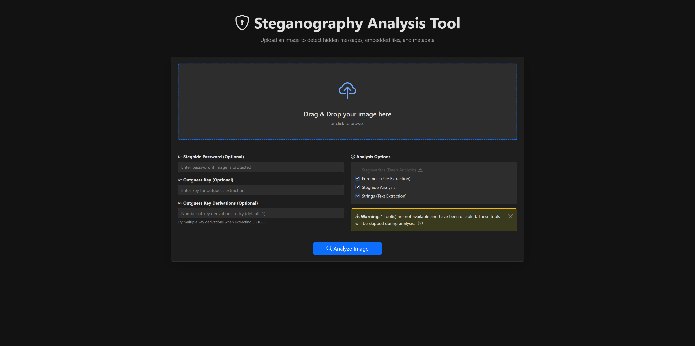

# Steganography Analysis Tool



A comprehensive web-based tool for analyzing images and detecting hidden messages, embedded files, and metadata using various steganography detection techniques.

## Features

- **Modern Web Interface**: Beautiful, responsive UI with drag-and-drop file upload
- **Multiple Analysis Tools**: Integrated with popular steganography detection tools
- **File Extraction**: Automatically extract embedded files and hidden data
- **Image Preview**: View uploaded images and extracted content
- **Download Support**: Download extracted files and analysis results
- **Auto-Cleanup**: Automatically removes uploaded files and analysis results after a configurable time period
- **Secure**: Input sanitization and secure file handling

## Supported File Types

- JPEG/JPG
- PNG
- GIF
- BMP
- WebP
- TIFF/TIF

## Analysis Tools

The tool integrates the following steganography analysis tools:

1. **Stegoveritas** - Deep analysis with multiple image transformations
2. **Foremost** - File carving and extraction
3. **Steghide** - Steghide steganography detection and extraction (with optional password)
4. **Outguess** - Outguess steganography detection
5. **Strings** - Text string extraction from binary files
6. **Exiv2** - EXIF metadata extraction
7. **ExifTool** - Comprehensive metadata analysis
8. **Binwalk** - Binary file analysis and embedded file detection
9. **xxd** - Hex dump analysis

## Requirements

### Server Requirements

- PHP 7.4 or higher
- Bash (for cleanup script)
- Web server (Apache/Nginx)

### Required Tools

The following command-line tools must be installed on your server:

- `stegoveritas` - [Installation Guide](https://github.com/bannsec/stegoVeritas)
- `foremost` - `apt-get install foremost` or `yum install foremost`
- `steghide` - `apt-get install steghide` or `yum install steghide`
- `outguess` - [Installation Guide](https://github.com/crorvick/outguess)
- `strings` - Usually pre-installed on Linux systems
- `exiv2` - `apt-get install exiv2` or `yum install exiv2`
- `exiftool` - [Installation Guide](https://exiftool.org/install.html)
- `binwalk` - `apt-get install binwalk` or `pip install binwalk`
- `xxd` - Usually pre-installed on Linux systems

## Installation

### Quick Installation (Recommended)

**For Ubuntu/Debian systems:**
```bash
sudo apt-get update && sudo apt-get install -y python3-pip foremost steghide outguess exiv2 libimage-exiftool-perl binwalk && sudo pip3 install stegoveritas
```

**For RHEL/CentOS systems:**
```bash
sudo yum install -y python3-pip foremost steghide outguess exiv2 perl-Image-ExifTool binwalk && sudo pip3 install stegoveritas
```

**For Fedora systems:**
```bash
sudo dnf install -y python3-pip foremost steghide outguess exiv2 perl-Image-ExifTool binwalk && sudo pip3 install stegoveritas
```

**Or use the automated installation script:**
```bash
# Full-featured script with error handling and verification
sudo bash install-tools.sh

# Or quick one-liner script
sudo bash install-all.sh
```

### Manual Installation

1. Clone or download this repository to your web server directory

```bash
git clone <repository-url> php-stego
```

2. Set proper permissions on the uploads directory

```bash
cd php-stego && \
sudo mkdir -p uploads && \
sudo chmod 755 uploads && \
sudo chown www-data:www-data uploads  # Adjust user/group as needed
```

3. Ensure bash is installed (usually pre-installed on Linux systems)

```bash
bash --version
```

4. Configure the application by editing `config.php`

```php
define('UPLOAD_DIR', 'uploads');  // Directory for uploads
define('DELETE_AFTER', 600);      // Auto-delete after 10 minutes
define('MAX_FILESIZE_BYTES', 10485760);  // 10MB max file size
```

5. Ensure all required tools are installed (see Requirements section)

6. Test the installation by accessing the tool in your web browser

## Configuration

Edit `config.php` to customize:

- **UPLOAD_DIR**: Directory where uploaded files and analysis results are stored (default: `uploads`)
- **DELETE_AFTER**: Time in seconds before auto-deletion (default: 600 = 10 minutes)
- **MAX_FILESIZE_BYTES**: Maximum upload file size (default: 10485760 = 10MB)
- **ALLOWED_FILE_EXTENSIONS**: Array of allowed file extensions
- **Tool Enable/Disable Flags**: Control which analysis tools are available

## Usage

1. Open the tool in your web browser
2. Upload an image file using drag-and-drop or file browser
3. (Optional) Enter a password if the image is protected with Steghide
4. Select which analysis tools to run (default: all enabled tools)
5. Click "Analyze Image"
6. Review the results:
   - View extracted files and download them
   - Check metadata information
   - Examine analysis reports
7. Files are automatically deleted after the configured time period

## File Structure

```
stego/
├── index.php              # Main application file
├── functions.php          # Core functions
├── config.php            # Configuration
├── deleteafter.sh        # Cleanup script
├── .gitignore            # Git ignore rules
├── README.md             # This file
├── uploads/              # Upload directory (gitignored)
│   └── [md5-hash]/      # User upload folders
│       ├── [filename]   # Uploaded image
│       ├── stegoveritas/ # Stegoveritas results
│       └── foremost/     # Foremost extraction results
└── bin/                  # Additional tools
    └── stegsolve.jar     # Stegsolve Java tool
```

## Security Considerations

- **File Upload Limits**: Configure `MAX_FILESIZE_BYTES` to limit file sizes
- **Directory Permissions**: Ensure upload directory has proper permissions
- **Auto-Cleanup**: Files are automatically deleted after a configurable time period
- **Input Sanitization**: All user inputs are sanitized before use
- **Shell Command Escaping**: All shell commands use proper escaping
- **MIME Type Validation**: Files are validated by both extension and MIME type

## Troubleshooting

### Tool Not Found Errors

If you see errors about tools not being found:

1. Verify the tool is installed: `which toolname`
2. Check if the tool is in your PATH
3. Some tools may need full paths in the code

### Permission Errors

If you see permission errors:

1. Check directory permissions: `ls -la uploads`
2. Ensure web server user can write to uploads directory
3. Check PHP error logs for detailed error messages

### Files Not Auto-Deleting

If files are not being deleted:

1. Verify bash is installed: `bash --version`
2. Check if `deleteafter.sh` has execute permissions: `chmod +x deleteafter.sh`
3. Verify the cleanup script is being called (check web server logs)
4. Consider setting up a crontab job for more reliable cleanup (see below)

## Automated Cleanup with Crontab (Optional)

The application already includes automatic cleanup: each upload triggers a background bash script (`deleteafter.sh`) that waits for the configured time period and then deletes the files. **Crontab setup is optional** but recommended as a backup/redundancy measure for production environments.

### When Crontab is Useful

Crontab cleanup is recommended if:
- Your server restarts frequently (background processes are lost on reboot)
- You want redundancy in case PHP processes fail
- You prefer a centralized cleanup mechanism
- You want to monitor cleanup via system logs

If your server is stable and PHP cleanup works reliably, crontab is **not strictly necessary**.

### Setting Up Crontab Cleanup

1. **Create a cleanup script** (optional - you can use `deleteafter.sh` directly):

Create a file called `cleanup-uploads.sh` in your project directory:

```bash
#!/bin/bash
# Cleanup script for steganography analysis tool uploads

UPLOAD_DIR="/path/to/your/stego/uploads"  # Update with your full path
DELETE_AFTER=600  # Time in seconds (default: 10 minutes)

# Find and delete directories older than DELETE_AFTER seconds
find "$UPLOAD_DIR" -mindepth 1 -maxdepth 1 -type d -mmin +$((DELETE_AFTER / 60)) -exec rm -rf {} \;
```

Make it executable:
```bash
chmod +x cleanup-uploads.sh
```

2. **Add to crontab**:

Edit your crontab:
```bash
crontab -e
```

Add one of the following entries (choose based on your preference):

**Option A: Using the cleanup script (recommended)**
```bash
# Run cleanup every 5 minutes
*/5 * * * * /path/to/your/stego/cleanup-uploads.sh > /dev/null 2>&1
```

**Option B: Using find command directly**
```bash
# Run cleanup every 5 minutes - finds old directories and deletes them
*/5 * * * * find /path/to/your/stego/uploads -mindepth 1 -maxdepth 1 -type d -mmin +10 -exec rm -rf {} \;
```

**Option C: Using a bash one-liner**
```bash
# Run cleanup every 5 minutes
*/5 * * * * find /path/to/your/stego/uploads -mindepth 1 -maxdepth 1 -type d -mmin +10 -exec rm -rf {} \;
```

3. **Verify crontab is set up correctly**:

```bash
# List current crontab entries
crontab -l

# Check cron service is running (systemd)
sudo systemctl status cron

# Or for older systems
sudo service cron status
```

### Crontab Configuration Notes

- **Frequency**: Adjust the cron schedule (`*/5 * * * *` = every 5 minutes) based on your needs
- **Path**: Always use absolute paths in crontab entries
- **Permissions**: Ensure the cron user has permission to delete files in the uploads directory
- **Logging**: Remove `> /dev/null 2>&1` if you want to capture errors in cron logs
- **Time Matching**: The crontab cleanup time should be less than or equal to `DELETE_AFTER` in `config.php` to ensure timely cleanup

### Recommended Setup

**For most environments**: The existing PHP cleanup is sufficient. No additional setup needed.

**For production environments with high reliability requirements**: 
1. Keep the PHP background cleanup (already implemented) - this handles normal cleanup
2. Add a crontab job as a backup (runs every 5-10 minutes) - this catches any missed cleanups
3. This provides redundancy and ensures cleanup even if PHP processes fail or server restarts occur

**Note**: Crontab is optional. The PHP cleanup mechanism works well for most use cases. Only add crontab if you need extra reliability or have concerns about background processes surviving server restarts.

Example crontab entry for production:
```bash
# Cleanup uploads every 5 minutes
*/5 * * * * find /var/www/html/stego/uploads -mindepth 1 -maxdepth 1 -type d -mmin +10 -exec rm -rf {} \; 2>&1 | logger -t stego-cleanup
```

This will also log cleanup actions to syslog for monitoring.

## Contributing

Contributions are welcome! Please feel free to submit a Pull Request.

## License

[Specify your license here]

## Credits

This tool integrates with the following open-source projects:

- Stegoveritas
- Foremost
- Steghide
- Outguess
- ExifTool
- Binwalk

## Support

For issues, questions, or feature requests, please open an issue on the repository.
